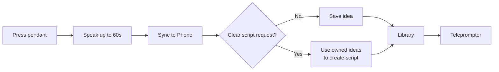

# Spark — Project Overview

**Implementation:** **Method B — functional web prototype.** Spark simulates a smart necklace in the browser, so the full idea-to-script experience can be demonstrated without custom hardware.

## Purpose

**Users:** solo video creators and people who get ideas away from their desk.

**Scenario:** while walking, travelling, or between tasks, a user records a thought instead of opening a notes app.

**Value:** Spark turns a quick spoken thought into a saved idea or a recordable video script with minimal interruption.

## How it works

1. Press the pendant control and speak naturally.
2. Spark uses live captions when available; otherwise it transcribes the audio after sync.
3. Normal speech is saved as an idea. An explicit script request creates a script from the user's ideas.
4. In the Phone library, users can review ideas, select up to 12 of their own ideas, and use the teleprompter.

## Technical layers

| Layer | Role |
| --- | --- |
| Front end | Next.js + React wearable and Phone UI; browser microphone, recording, captions, and local queue. |
| Backend / API | Next.js routes validate requests, authenticate sessions, process captures, and return safe errors. |
| AI | OpenAI Whisper transcribes audio; OpenAI Agents creates structured video scripts. |
| Data | Supabase Auth and Postgres store user-owned ideas and scripts. Row-level security protects ownership. |

## Run the demo

1. Set `SUPABASE_URL`, `SUPABASE_PUBLISHABLE_KEY`, and server-only `OPENAI_API_KEY` in `.env.local`.
2. Apply [`20260908000000_voice_capture.sql`](../supabase/migrations/20260908000000_voice_capture.sql).
3. Run `npm install`, then `npm run dev`; open `http://localhost:3000`.
4. Sign in, record a thought, open Phone to sync, then create and read a script.

## Decisions and device status

- **Privacy:** audio stays transiently in the browser until sync, is processed for transcription, then discarded; only successful ideas and scripts are saved.
- **Trade-off:** this demo uses a browser pendant and simulated haptics/battery instead of physical hardware. Rate limits are in-memory and would need shared storage in production.
- **AI in development:** AI supported coding, test planning, and documentation; in the product, it handles transcription and script drafting from authorized user ideas.
- **Current device status:** software prototype. The microphone is real; the necklace, battery, and haptic feedback are simulated.
